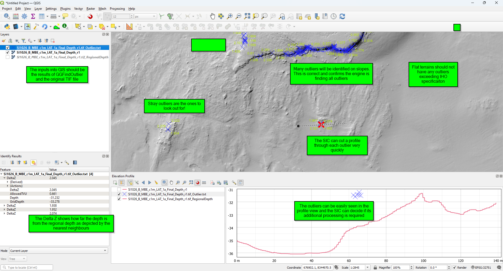

# ggoutlier.py
ggoutlier uses machine learning...

## What is an Outlier?
In bathymetry, an outlier typically refers to an isolated or anomalous depth measurement or feature on a seafloor depth map or chart. These outliers can be depths that are significantly different from the surrounding seafloor topography. Outliers might be caused by various factors such as errors in data collection, equipment malfunction, or unique geological features like wrecks, obstructions, seamounts or underwater volcanoes that stand out from the surrounding seabed. The scale of an outlier can be considerable. Identifying and understanding  outliers in bathymetric data is important for accurate navigation, scientific research, and ocean exploration. Separating a real feature from noise is a complex issue. The final decision comes down to the skill and experience of the Surveyor In Charge. GGOutlier efficiently analyse and highlight outliers for validation.

## Installation Requirements
* python 3.10 or newer
* pip install reportlab
* pip install pyproj
* pip install pyshp
* pip install scikit-learn
* pip install rasterio

## GGOutlier Principles
GGOutlier is a tool developed by Guardian Geomatics to Quality Control processed a multibeam bathymetry surface, and validate a processed depth surface against a standard such as those published by IHO SP44 or HIPP. The principle is similar in methodology to a traditional  review by a surveyor-in-charge (SIC) process in which the SIC would review the depth surface by identifying outliers relative to its nearest neighours, determine if the outlier is significant and if so flag it forinvestigation.
GGOutlier primary purpose is to positively, rigorously identify each and every depth which is considered an outlier relative to the required total vertical uncertainty at that depth. This provides the SIC and client with full confidence that the quality of the depth surface meets the required specification and any remaining outliers are known, have been investigated and are considered features rather than noise.
Inliers are points which do meet the required specification for allowable total vertical uncertainty.
Outliers are points which do NOT meet the required specification for allowable Total Vertical Uncertainty (TVU).

## How to run GGOutlier
Run the script like this...
'''
python ggoutlier.py
'''

To get help on the script...
'''
python ggoutlier.py -h
'''
To run the script on a specific file...
'''
python ggoutlier.py -i c:\temp\pk.tif
'''

To run the script on a specific file...
'''
python ggoutlier.py -i c:\temp\pk.tif
'''
The easiest way is to open a command window in the folder where your depth.tif file resides

```
Y:\Subsea-Cloud\ggtools\kmallclean\SI1026_F>python y:\subsea-cloud\ggtools\ggoutlier\ggoutlier.py -i . -standard order1a
```

To specify the file to process you use the <-i filename.tif> parameter.  if you are in teh folder where the file exists you can type <-i .> or even skip the parameter entirely.

To specify a standard use the -standard parameter, <-standard order1a>

## What are the Inputs?
Inputs are very simple. A depth surface (a floating point TIF file) and a IHO SP44 specification such
as 'order1a', 'specialorder'.

```
usage: ggoutlier.py [-h] [-i INPUTFILE] [-epsg EPSG] [-odir ODIR] [-near NEAR] [-standard STANDARD] [-unc UNCERTAINTYFILENAME]

Analyse a floating point TIF file of depths and find all outliers exceeding a user specified threshold.

options:
  -h, --help            show this help message and exit
  -i INPUTFILE          (required) Input filename/folder to process.
  -epsg EPSG            (optional) Specify an output EPSG code for transforming from WGS84 to East,North. If the TIF file is georeferenced this is not required to be specified. e.g. -epsg 32751
  -odir ODIR            (optional) Specify a relative output folder. normally leave this empty. a folder will be created for you. e.g. -odir GIS
  -near NEAR            (optional) ADVANCED:Specify the MEDIAN filter kernel width for computation of the regional surface so nearest neighbours can be calculated. [Default:5]
  -standard STANDARD    (optional) Specify the IHO SP44 survey order so we can set the filters to match the required specification. Select from :['order2', 'order1b', 'order1a', 'specialorder',
                        'exclusiveorder', 'hipp1', 'hipp2', 'hippassage'] [Default:order1a]
  -unc UNCERTAINTYFILENAME
                        (optional) Specify the Uncertainty TIF filename, which is used with the allowable TVU to compute the TVU barometer [Default:<nothing>]
```

## What does it do?
A 'Regional Surface' is created using median depths of the nearest neighbours to each depth.
A 'TVU Surface' is created. This is the allowable TVU for the depth of each and every pixel.
A 'DeltaZ Surface is created. This is the difference between the regional surface and the depth
surface
The DeltaZ values are then assessed against the TVU for that depth and either flagged as an
outlier or accepted as within specification. The flagged depths are called 'outliers'.

## What are the outputs
GGOutlier does NOT modify the input file in any way. It is a read-only process.
The primary output is Outliers saved to a point cloud file and a shape file. The shape file contains the processed
depth, the Regional Depth, the AllowableTVU, the DeltaZ (difference between Regional Depth and
processed depth) and a field for Review/Approval by SIC. This file should be loaded to CARIS/GIS so the identified outliers can be reviewe.  Please remember an outlier is EITHER a spike OR a feature.  The reviewer has to make the choice.  GGOutlier allows the reviewer to focus on the depths which do not meet specification.  this does not mean they are a spike.  It means they need to be understood what they are.
GGOutlier will generate a QC report PDF in order to enable rapid assessment of results.

## Role of Surveyor In Charge
The SIC role is essential. The resulting shape file identifies all depths which do NOT meet the IHO specificaiton. These are either outliers missed in processing or depths on stepp slopes which inherently will not meet TVU specification due to gridding resolution limitations. it is the role of the SIC to review these flagged outliers and confirm they are valid or need to be passed back to the data processors for additional  cleaning.
The SIC should edit the shape file attribute field to document each outlier has been reveiwed and approved.

## Role of Data Processor
The shape file can be loaded into the processing software (ag CARIS, Qimera) and used to guide the data processor to revisit the ungridded raw data points and re-evaluate underlying data and edit if required.
If additional edits are required, the DP shall regenerate the depth surface and rerun GGOutlier.

## Role of Client Representative
The shape file and Regional Depth will be delivered as part of a survey report. This can be used by the client to gain confidence all outliers have been reviewed by the SIC and there are no additional outliers in the depth surface.
Below is an example of how to consume the results from GGOutlier using GIS to analyse outliers which do not meet specification.


